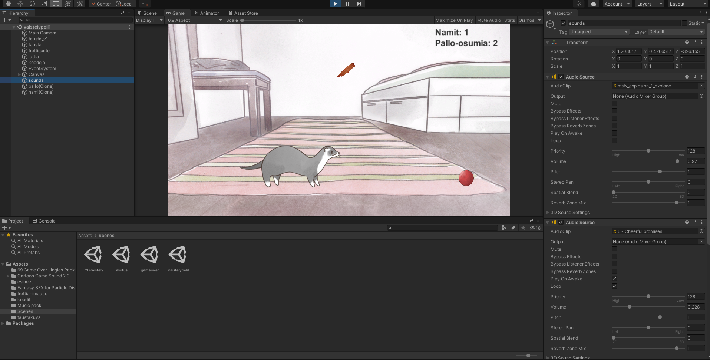
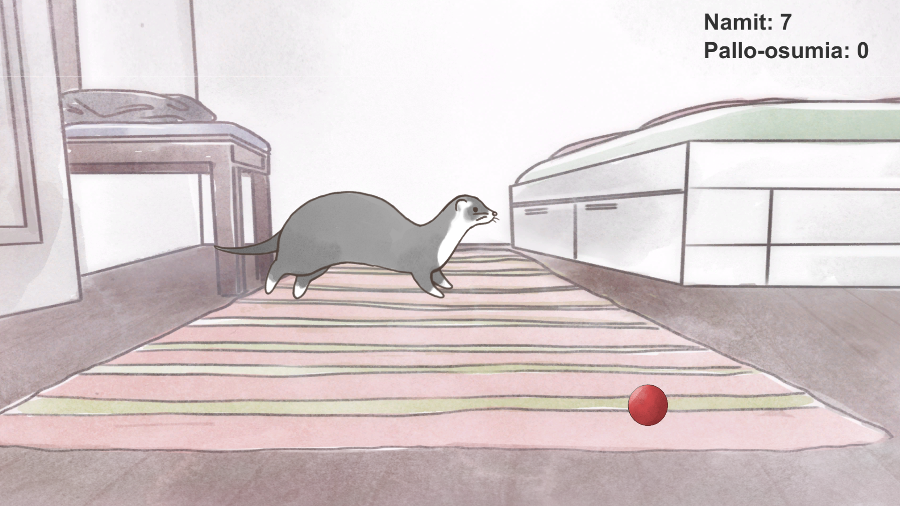
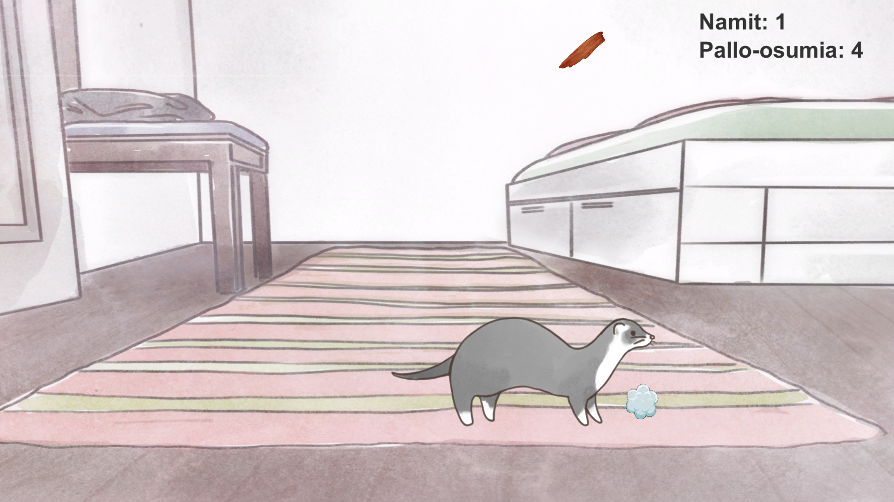
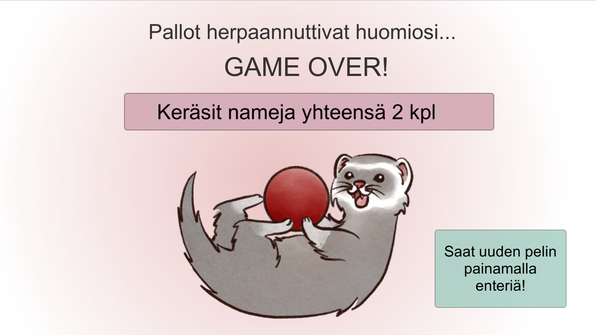

# ferretgame

A ferret themed game made for Unity course in summer 2021

# Fretti-peli

## Pelin toiminta

Pelaaja aloittaa pelin aloitusvalikosta, mistä peliin pääsee painamalla enteriä.

Pelissä pelaaja ohjaa frettiä, jonka tarkoituksena on napata mahdollisimman paljon tippuvia
nameja. Omistaja kuitenkin heittelee frettiä palloilla ja yrittää hämäännyttää frettiä namien
nappaamisessa. Fretin on väistettävä palloja, koska jos palloja osuu frettiin 5, fretti hämääntyy
ja aloittaa pallon kanssa leikkimisen, jolloin peli on ohi.

Game over-ruudussa näytetään paljon nameja pelaaja on napannut ja uuden pelin saa painamalla
enter-näppäintä.

Pelissä on käytetty ääniefektejä sekä musiikkia.

## Kuvia pelistä

## Copyright

Tausta, fretti + frettianimaatio, namit ja pallot ovat omaa käsiäalaani. Pallosta tuleva savupilvi
on Googlen kuvahaulla löytynyt animaatio. Musiikit (aloitusmusiikki, pelin musiikki ja game over-
scenen musiikki) on löydetty Unityn Asset Storesta ja namien syömisen ääniefekti on löytynyt
Googlen haulla.
